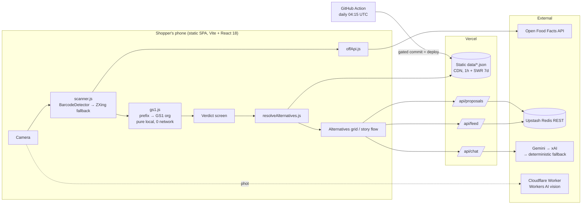

# Vendorja — Architecture

Scan a barcode in a Kosovo shop, learn which GS1 organisation registered it,
and get a verified local (Kosovo/Albanian) alternative — in under a second,
offline-tolerant, and without ever claiming more than the data supports.

## System at a glance



## The scan flow

1. **Decode.** `BarcodeDetector` where the browser has it (Chrome/Android);
   ZXing, pinned from jsdelivr, everywhere else (iOS Safari, Firefox). Manual
   entry always works.
2. **Verdict before the network.** The 3-digit prefix is classified against
   `data/gs1-prefixes.json` in memory. A GS1-Serbia barcode is flagged with
   zero network latency, even if every upstream is down.
3. **Product lookup.** Open Food Facts gives name, brand, photo and
   categories. A miss or a 503 never blanks the verdict; it hands the shopper
   a one-tap category picker instead.
4. **Alternatives, ranked by confidence.**
   1. curated brand pairing from `brand-alternatives.json` (source-cited);
   2. curated category match;
   3. the local product pool, walked from the most specific category to the
      least specific;
   4. a live OFF search that only tops up, failing silently.

   Every candidate passes `isEligibleLocalCandidate`: it counts as local only
   if its own barcode carries a local GS1 range (381/390/530) or its brand is
   in the curated, cited list. "Sold in Kosovo" is not treated as "made by a
   local producer."

## Server side — three functions, no framework

| Route | Job | Degrades to |
|---|---|---|
| `api/chat.js` | Store/shopper assistant | deterministic reply (`mode: "fallback"`) |
| `api/feed.js` | Public scan history | `503 not_provisioned` → local-only history |
| `api/proposals.js` | Shopper-proposed alternatives, human vetting queue | same 503 posture |

All three talk to Upstash over plain `fetch`, with no npm dependency, so the
build stays untouched. They are rate-limited per IP and store no personal data.

### Chat guardrails (the anti-hallucination design)

- **Retrieval in code first** (`_chat-retrieve.js`). Which alternatives appear
  is decided from the catalogue before any model runs, and the UI cards render
  from that retrieval, never from model text.
- **The model only phrases**, at temperature 0. The provider chain is a
  store's own xAI key, then Gemini, then the site's xAI key, then a
  deterministic reply.
- **Output check.** A reply is rejected if it names an un-retrieved brand or
  claims a country of manufacture.
- **"Why buy local" answers** (`_chat-why.js`) may only cite numbers from the
  verified trade dossier.

## Proxies and edge layers

- **Vercel routing** (`vercel.json`): it redirects the vercel.app host to the
  canonical domain, rewrites `/b/:code` deep links onto one SPA shell, and
  serves pre-rendered SEO pages via clean URLs.
- **Cache tiers:** hashed assets are immutable for 1 year; images are cached
  for 30 days; `data/*.json` gets 1 hour plus 7 days stale-while-revalidate,
  so a fresh catalogue propagates within the hour without cold misses.
- **Vision worker** (`vision-worker/`, Cloudflare Workers AI): it reads the
  brand printed on a product photo with Llama 3.2 11B Vision, with LLaVA as
  the fallback. It answers "whose product is this?" when there is no barcode.

## Data pipeline

`scripts/` holds the harvesters, mergers, enrichers, and the verify gates.
`.github/workflows/refresh-catalogue.yml` re-runs the harvest daily and
commits **only if every gate passes**: zero wrong-family matches, zero false
"local" claims, currency sanity, a row floor and size ceiling, then
`npm test` and `npm run build`. On any failure it restores the previous file
byte for byte. Because a commit is a deploy, nothing broken can ship
unattended.

## Repository map

```
api/            serverless routes (chat, feed, proposals) + retrieval helpers
data/           curated + harvested JSON (GS1 table, catalogue, pairings, stores)
scripts/        dataset build, enrichment, SEO generation, eval + verify gates
src/lib/        pure logic: gs1, matcher, resolveAlternatives, scanner, router
src/components/ screens: scanner, verdict, story flow, explore, history, chat
src/i18n/       Albanian/English dictionary
vision-worker/  Cloudflare Worker for photo → brand
docs/           data, refresh and sourcing notes
```

## Honesty rule

A GS1 prefix tells you where a barcode was **registered**, not where the
product was made. Vendorja says "barcode registered with GS1 Serbia", never
"made in Serbia", on every result screen, and the chat output check enforces
the same rule.
